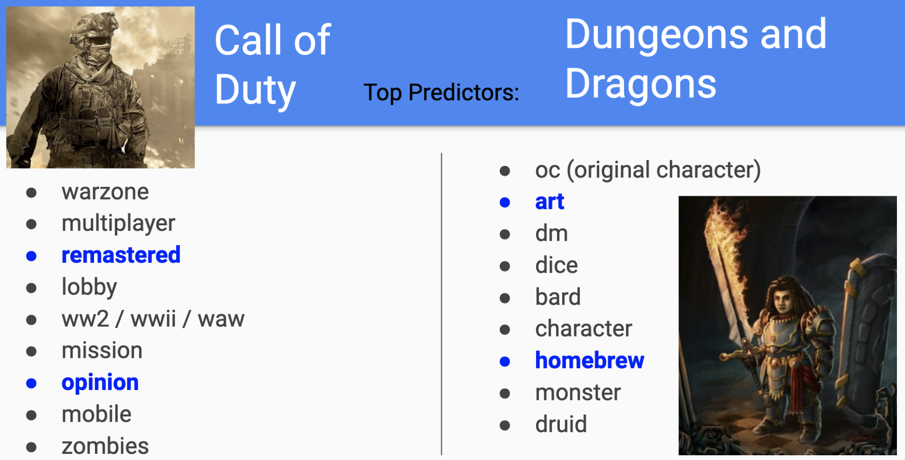

# Comparing Game Communities by Text Analysis

Web APIs, NLP and Classification to answer the question

"What differentiates the player communities for **Call of Duty** and **Dungeons and Dragons**?"

### Contents:
- [Executive Summary](#Executive-Summary)
- [Background](#Background)
- [NLP Models](#NLP-Models)
- [Conclusions](#Conclusions)
- [References](#References)

## Executive Summary

Understanding game communities is a key piece in understanding the popularity and longevity of any game. In this study, the online forum 'reddit' was used as a source of information about the communities for two games: **Call of Duty** and **Dungeons and Dragons**. Natural Language Processing (NLP) tools were used to explore posted text to gain insight into the differences (if any) between these two groups.

In May 2020, 4000 posts made to each of the subreddits

**/r/CallOfDuty**    
       and   
**/r/DnD**

were gathered using [Pushshift's](https://github.com/pushshift/api) API and then analyzed by Natural Language Processing (NLP) machine learning models.

Key findings included:  
- Both communities discuss game settings and game mechanics (things like items in the game or rules)
- Call of Duty posts contained more references to upcoming releases from the game company
- Dungeons and Dragons posts contained more references to player generated material

## Background

The two games, Call of Duty (CoD) and Dungeons and Dragons (DnD) have some known similarities and differences shown in the table below.

||Call of Duty|Dungeons and Dragons|
|---|---|---|
|Setting|Low fantasy - military combat gear|High fantasy - dragons, magic|
|Solo play|most common|unusual|
|Co-op play|less common|most common|
|Player vs Player|optional|discouraged|
|Format|electronic console|mostly table-top (in person), some online options|
|Goal|Defeat the enemy in a scenario|Defeat the enemy in a scenario|

It was expected that these differences would show up in the text of the posts, but there were possibilities for other differences as well. Profanity? Did the Player vs Player (PVP) aspect affect how authors referred to each other in posts?  

## NLP Models

Four base models, consisting of
1. CountVectorizer + LogisticRegression
2. TfidfVectorizer + LogisticRegression
3. CountVectorizer + MultinomialNB. (Naive Bayes)
4. TfidfVectorizer + SVC (Support Vector Machine Classifier)

were tuned and evaluated. All 4 models were able to classify a new post as coming from either Call of Duty or from Dungeons and Dragons with 92% accuracy, which is significantly higher than the baseline of 50% accuracy achieved by guessing one of them -- e.g. "It's Call of Duty!" -- every time.

**Summary of predictions on test data**   

|Model| Sensitivity|Specificity|Precision|Accuracy|
|---|---|---|---|---|
|Baseline model|1.0000|0.0000|0.5021|0.5021|
|Best CountVec - LogReg|0.8786|0.9670|0.9642|0.9226|
|Best TfidfVec - LogReg|0.8969|0.9361|0.9341|0.9165|
|Best CountVec - MultiNB|0.9214|0.8373|0.8511|0.8795|
|Best TfidfVec - SVC|0.8908|0.9331|0.9307|0.9118|

With this high level of performance, any of the models could be used to move to the next step. However, models with a logistic regression estimator are better candidates for exploring the impact of the terms since each term can be paired with its relative importance to the model. Using the CountVectorizer + LogisticRegression model, the terms with the greatest predictive power for each group are shown below.

### Next Steps

A follow-up study could be designed to explore questions such as these:

- Do most community discussions center around game mechanics? Is this true for other games and for other online communities outside of reddit?   
  - Call of Duty: warzone, lobby, mission, etc.   
  - Dungeons and Dragons: dice, dm (dungeon master), oc (original character), etc.
- The non-game-mechanic vocabulary seems to indicate how the community sees their interaction with the game:
  - Call of Duty:
    - 'remastered' --> waiting for new content
    - 'opinion' --> evaluating the game as an observer / consumer
  - Dungeons and Dragons:
    - 'art' --> appreciating provided artwork and/or generating new artwork
    - 'homebrew' --> making contributions and/or actively engaging in creating the game experience   
  - Is part of this difference due to the upcoming release of new versions of Call of Duty?
  - If data were pulled from other time periods, would this be replaced by something else, and if so, what might that be?
  - If this difference is an accurate insight, can it be correlated with sales of other merchandise such as posters or paintable figures?

_Note: 'homebrew' is a term akin to 'fan fiction' that indicates assets or creative content made by players rather than by the original game designers._

## Conclusions

Based on the ability of the NLP models to accurately classify 92% of posts, it is clear that these two communities have unique discussion topics and vocabulary.

Based on some of the highly predictive terms -- 'remastered' for Call of Duty and 'homebrew' for Dungeons and Dragons -- both communities are highly engaged and interest remains high in both games.

The fact that over 4000 posts were made to each of these subreddits in less than a month indicates that both communities are very active, and an investment in understanding and supporting these communities may pay valuable dividends by encouraging continued interest.

In the case of Call of Duty, continued player engagement will likely focus on in-game and meta-game content provided by the game company.

In the case of Dungeons and Dragons, continued player engagement will likely focus on creative aspects of the game and player-generated art. Continued engagement may focus on providing encouragement and support for players to engage with materials outside game play.

## References

[Presentation Materials](presentation/NLP-DnD-CoD.pdf)  

[Pushshift's API](https://github.com/pushshift/api)    

[Call of Duty subreddit](https://www.reddit.com/r/CallOfDuty/)     
[Dungeons and Dragons subreddit](https://www.reddit.com/r/DnD/)

----------------------------------------------------------------------------
[Data Science Portfolio](https://jshaffer94247.github.io/)
